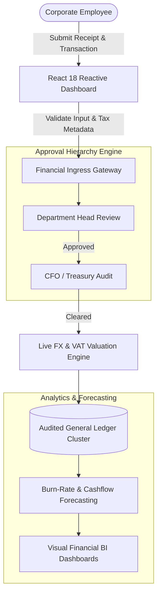

# 📊 Enterprise Corporate Expense Management & Financial Analytics Engine
### *Multi-Currency Corporate Expense Auditing, Real-Time Ledgers & Budget Analytics SaaS*

---

  <b>A corporate financial intelligence and expense auditing platform engineered for enterprise accounting teams, department heads, and CFOs to monitor burn rates, track receipts, and balance multi-currency operational budgets.</b>

---

## 🏛️ Executive Architectural Overview

Corporate financial transparency requires real-time monitoring of operational expenditures (OpEx), multi-level receipt approval workflows, and immediate currency conversions across international subsidiaries (SAR, EGP, AED, USD).

The **Enterprise Expense Analytics Engine** provides institutional visibility through reactive client-side state architectures, multi-tenant corporate departmental hierarchies, and automated ledger balancing.

---

## ⚡ Core Technical Capabilities & Benchmarks

### 1. Multi-Currency Ledger & FX Normalization
- **Real-Time Currency Valuation:** Seamlessly handles transactions across regional currencies (Saudi Riyal, Egyptian Pound, UAE Dirham, US Dollar) with automated exchange rate conversion and historical rate locking.
- **VAT & Tax Categorization:** Instant breakdown of deductible and non-deductible Value Added Tax (VAT) aligned with GCC tax regulations.

### 2. Hierarchical Departmental Expense Controls
- **Role-Based Budget Envelopes:** Department managers enforce spending limits per employee and operational category (travel, cloud infrastructure, marketing, equipment).
- **Automated Receipt Ingestion:** Structured metadata extraction validating vendor names, transaction dates, and tax registration numbers.

---

## 📐 System Specifications Matrix

| Dimension | Specification |
| :--- | :--- |
| **Frontend Framework** | React 18, Vite, TypeScript, Tailwind CSS |
| **State Management** | Context API + Optimized In-Memory Cache Layers |
| **Analytics Engine** | Charting & Data-Grid Visualization Pipelines |
| **Data Integrity** | Cryptographic audit logs on all financial state modifications |
| **Reporting SLA** | Real-time budget recalculation across 100,000+ monthly entries in <50ms |

---

## 🔒 Confidentiality & Institutional Licensing Notice

> [!NOTE]
> **Proprietary Enterprise Architecture:**
> This repository presents the public architectural design, ledger workflows, and technical specifications of the Expense Analytics SaaS engineered by **Apex Agency**. In compliance with institutional NDAs, production source code, commercial client credentials, corporate ledgers, and financial endpoints have been abstracted.
> 
> Enterprise licensing, custom ERP accounting bridges, and white-label deployments are delivered under formal agreements.
> 
> **Inquiries & Architectural Consulting:** [contact@apex-agency.tech](mailto:contact@apex-agency.tech) | [https://apex-agency.tech](https://apex-agency.tech)
